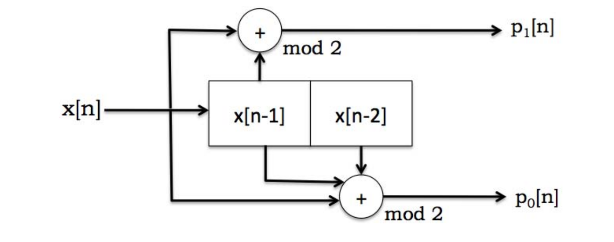
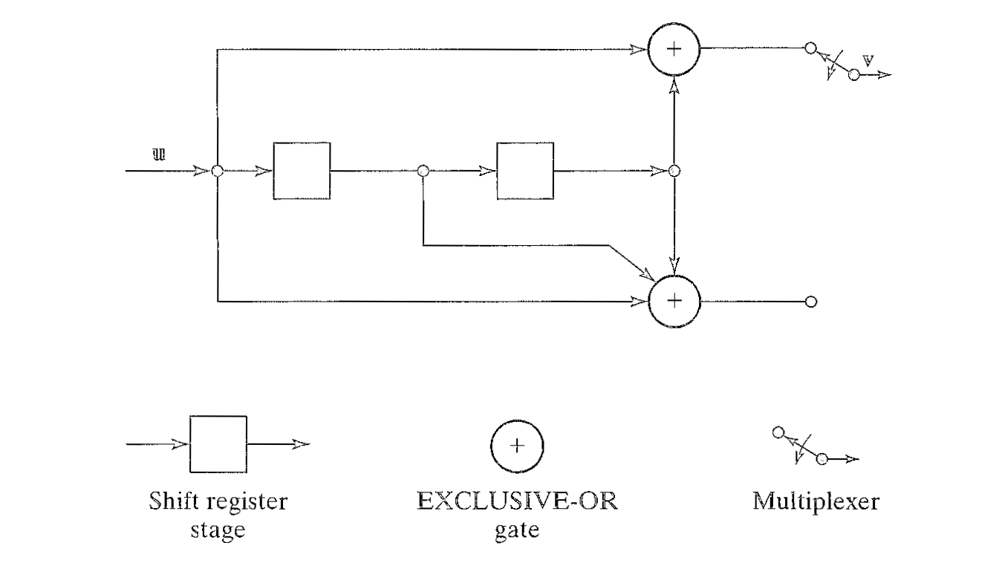
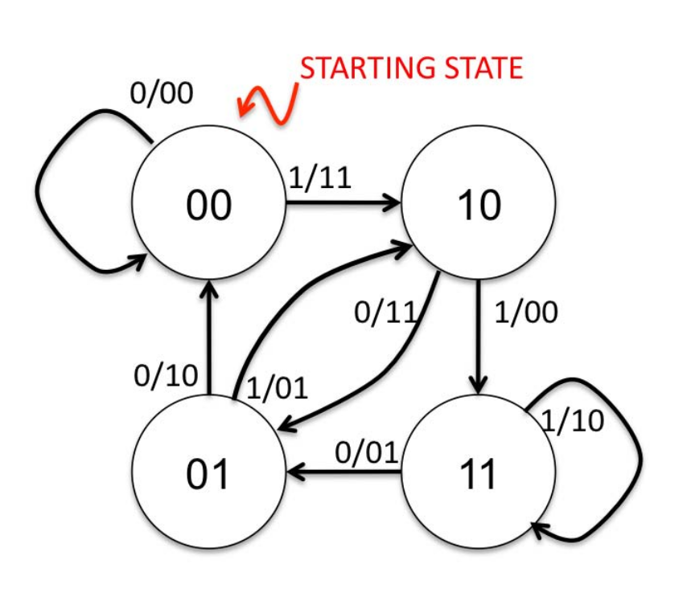
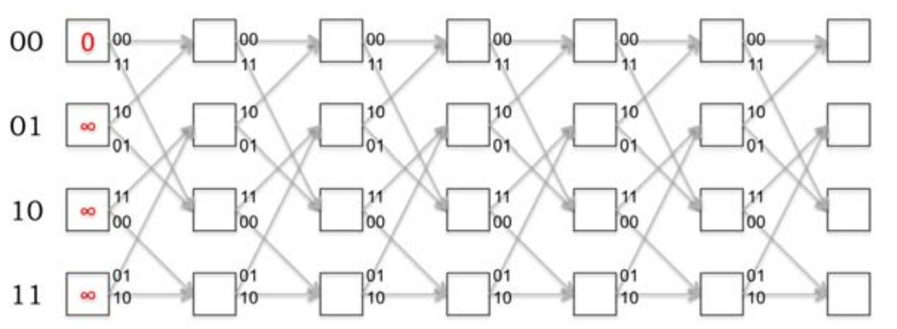
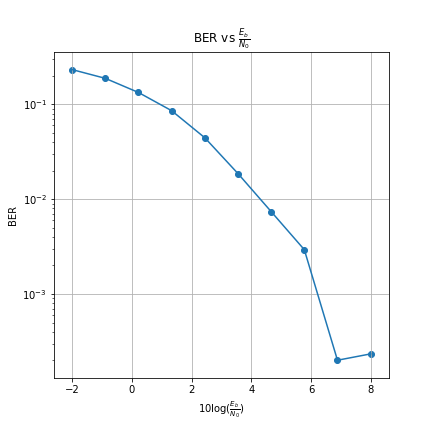
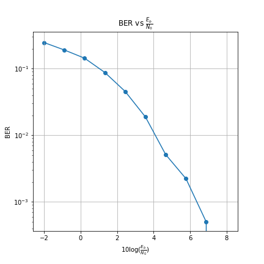

# Convolutional Codes

Implementation of 2 Memory Unit and 2 Output Unit Convolutional Encoder and Decoder i.e Bit-Rate = 0.5. Viterbi Algorithm is used in Implementation of Convolutional Decoder. 2-PAM Modulation scheme is used for Bit Transmission.

Video References:
1. [Introduction to Convolutional Encoder](https://www.youtube.com/watch?v=AnyVu5eDhAQ&t=2734s)
2. [Viterbi Decoder](https://www.youtube.com/watch?v=z1MdvYu2ZHk&t=2171s)

Reading References: MIT Lectures. Corresponding PDFs are in References folder.

### Convolutional Encoder
Image of Block Diagram of 2 Memory Unit and 2 Output Unit Convolutional Encoder

#### Type-1

#### Type-2

The difference between Type-1 and Type-2 are XOR operation is performed between x[n] and x[n-1] in Type-1 and between x[n] and x[n-2] in Type-2.

### State Diagram
Image of State Diagram of 2 Memory Unit and 2 Output Unit Convolutional Encoder. State Diagram is used to construct Trellis Diagram which is needed to implement Viterbi Decoder.

The following is the State Diagram of Type-1 Convolutional Encoder.

### Trellis Diagram
The following is an example image of Path Metric initialized Trellis Diagram.

The following is the Trellis Diagram of Type-1 Convolutional Encoder.

### Results
#### Type-1
The following is the result for Type-1 Convolutional Encoder and Decoder

#### Type-2
The following is the result for Type-2 Convolutional Encoder and Decoder

