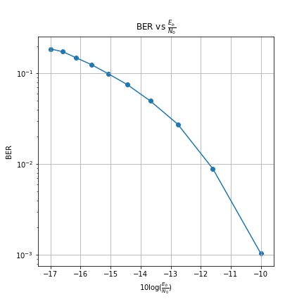

# Convolutional Codes

Implementation of 2 Memory Unit and 2 Output Unit Convolutional Encoder and Decoder i.e Bit-Rate = 0.5. Viterbi Algorithm is used in Implementation of Convolutional Decoder. 2-PAM Modulation scheme is used for Bit Transmission.

Video References:
1. [Introduction to Convolutional Encoder](https://www.youtube.com/watch?v=AnyVu5eDhAQ&t=2734s)
2. [Viterbi Decoder](https://www.youtube.com/watch?v=z1MdvYu2ZHk&t=2171s)

Reading References: MIT Lectures. Corresponding PDFs are in References folder.

### Convolutional Encoder
Image of Block Diagram of 2 Memory Unit and 2 Output Unit Convolutional Encoder

### State Diagram
Image of State Diagram of 2 Memory Unit and 2 Output Unit Convolutional Encoder. State Diagram is used to construct Trellis Diagram which is needed to implement Viterbi Decoder.

### Trellis Diagram
The following is an example image of Path Metric initialized Trellis Diagram.

### Results

